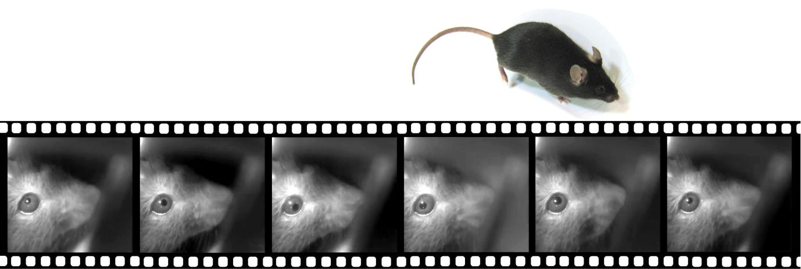
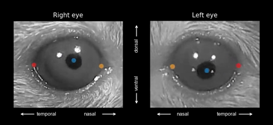
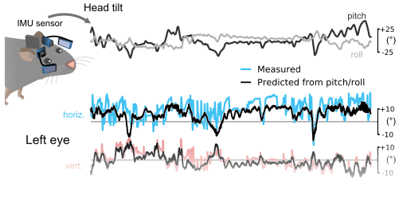

# Meyer et al. Current Biology (2020)

Some code and example data for our paper on head and eye movements in freely moving mice:

>Arne F. Meyer, John O'Keefe and Jasper Poort (2020): Two Distinct Types of  Eye-Head  Coupling in Freely Moving Mice. Current Biology, 30. [Link to paper (open access)](https://www.cell.com/current-biology/fulltext/S0960-9822(20)30556-X)

This is still work in progress and more code and data sets will be added in the future. If some specific analysis code or data will be particularly useful, please raise a github issue.


## Eye tracking using DeepLabCut



We used [DeepLabCut](http://www.deeplabcut.org) (DLC) to extract pupil positions from head-mounted camera images. As newer DLC versions now support many of the features that we manually implemented for the paper (e.g., ROI extraction), we strongly recommend using the DLC functions directly. Nevertheless, we provide a simple script (`example_eye_tracking_DLC.py`) outlining the steps for extracting pupil positions along with eye reference points (for automatic alignment of eye axes) from videos recorded using the [head-mounted camera system (mousecam)](https://open-ephys.org/mousecam) that we used in the paper.

Example usage:
```
python example_eye_tracking_DLC.py create-project .
```

This will create a DLC project in the current folder and add the provided
example video file (`data/example_eye_camera_video.mp4`).

To get all commands use `python example_eye_tracking_DLC.py --help`:
```
Usage: example_eye_tracking_dlc.py [OPTIONS] COMMAND [ARGS]...

Options:
  --help  Show this message and exit.

Commands:
  convert-h264    convert h264 files to mp4
  create-project  run all steps to create a DLC project
```

To see all options for creating a DLC project use `python example_eye_tracking_DLC.py create-project --help`:
```
Usage: example_eye_tracking_dlc.py create-project [OPTIONS] PROJECT_PATH
                                                  [VIDEO_PATHS]...

  run all steps to create a DLC project

Options:
  -n, --name TEXT           DLC project name. Default: eye_video_demo
  -e, --experimenter TEXT   DLC experimenter name. Default: experimenter
  -r, --recursive           Recursively search for video files
  -f, --format [h264|mp4]   File format when using the recursive mode (either
                            'mp4' or 'h264'). Default: mp4

  -E, --exclude TEXT        Exclude video files matching this pattern
                            (mulitple possible)

  -n, --num-frames INTEGER  Number of frames to manually label. Default: 20
  -t, --train               Train network (make sure to have a GPU when using
                            this option)

  -a, --analyze             Extract pupil positions after training
  -c, --create-videos       Create videos with tracking markers after pupil
                            position extraction

  --help                    Show this message and exit.
```

#### Required packages

- deeplabcut (including all dependencies)


## Prediction of eye position from head tilt



The Python script `example_head_tilt.py` reproduces the traces shown in Figure 3. Briefly, eye positions were predicted from head tilt (combined pitch and roll) using a nonlinear (or optionally linear) regression model. Predictions were done using cross-validation (n=5 fold).

Example usage:
```
python example_head_tilt.py
```

To get all supported options use `python example_head_tilt.py --help`:
```
Usage: example_head_tilt.py [OPTIONS]

Options:
  -m, --model [linear|nonlinear]  Regression model for predicting eye position
                                  from head tilt ('linear' or 'nonlinear').
                                  Default is 'nonlinear'

  --help                          Show this message and exit.
```


#### Required packages

- numpy
- matplotlib
- scikit-learn
- click

custom packages (install via `python setup.py install`):

- https://github.com/arnefmeyer/mousecam
- https://github.com/arnefmeyer/lnpy (only required when using the 'linear' model)
